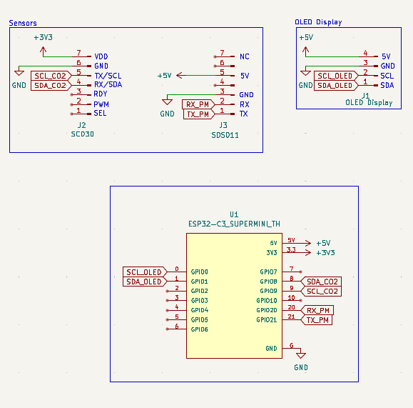

# PortAQI

Poor air quality can be dangerous, especially to children and aged folks. This project aims to work as a tool to determine when intervention is needed. 

It is made with the Indian diaspora in mind, where AQI can vary seasonally, and it might not be economically feasible or practically possible for everyone to keep devices such as air filters running all day. Or, it can also be used to simply judge the AQI for the particular area you're living in, to determine if intervention is needed or not.

## Features:
- SCD30 and SDS011 sensors to detect air CO2 and particulate matter levels.
- ESP32-C3 module serves as the primary microprocessor.
- An OLED Display to display resulting data.

## Schematic:

## BOM:
- ESP32-C3 Supermini
- SCD30 CO2, Temperature and Humidity Sensor
- SDS011 Particulate Matter sensor
- 1.3 Inch I2C 4 Pin OLED Display
